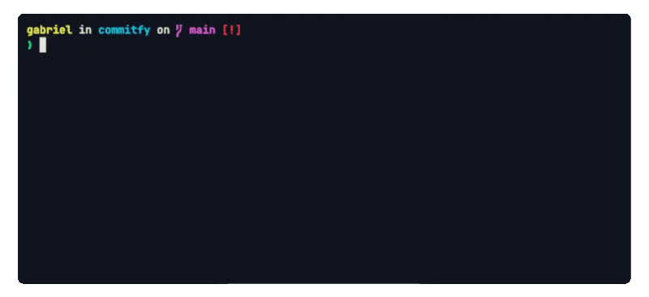

<div align="center">
  
</div>

# commitfy

> Generating **commits for you** in 1 second using AI. ✨

## Description

`commitfy` is a tool designed to help developers generate efficient and consistent commit messages using artificial intelligence. `commitfy` ensures that your commit messages follow established standards and are clear and informative.



## Installation

Install `commitfy` globally to use in any repository using npm:

```bash
npm install -g commitfy
```

## Usage

Once installed, you can use the `commitfy` command or its alias `cfy` to interact with the tool.

### Commands

#### Initial Setup

To perform the initial setup configuration, run:

```bash
cfy setup
```

This command will guide you through the necessary setup to use `commitfy`, such as choosing the AI provider and configuring API keys.

#### Generate Commit Message

To generate a commit message using AI, simply run:

```bash
cfy
```

> **Note:** Before generating a commit message, ensure you are in a repository with Git initialized and have files added to the stage using `git add`.

#### Help

If you need assistance or want to see the available commands, run:

```bash
commitfy --help
```

This command will display a list of all available commands along with detailed descriptions.

## Configuration

### Configuration Files

`commitfy` uses configuration files located in the `~/.commitfy` directory to manage its settings and behavior:

- **`.env`**: This file contains all the necessary configurations for the app, such as API keys and other environment variables. You can edit this file to update your settings as needed.
  
- **`.commitfyignore`**: This file functions similarly to a `.gitignore` file. It is used to specify files and directories that should be ignored when generating commit messages. By customizing this file, you can control which changes are considered when `commitfy` creates a commit message.

## AI Providers

`commitfy` supports the following AI providers for generating commit messages:

- **OpenAI**

> **Note:** Currently, we only support OpenAI, but we plan to add more providers in the future. If you have a suggestion for an AI provider, please [open an issue](https://github.com/ribeirogab/commitfy/issues).
